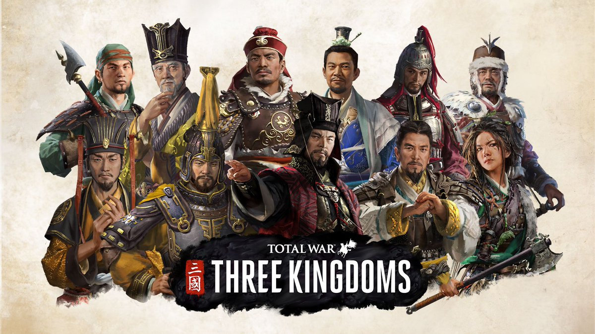

# Game Wiki of Total War Three kingdoms

This project aims at get game infomation from [honga.net](https://www.honga.net/totalwar/three_kingdoms/index.php?l=en&v=three_kingdoms)

## How to Use

Additional parameter `l` is used as to choose which language to scrape. `scrapy crawl character -a l=zh-CN`

### Fleet Automation
1. First, clone the project to your local machine.
2. Use `run.json` to config `run & debug`

### Scrapy CLI
1. Make sure scrapy is installed.
2. Run `scrapy crawl character`

## File Structure

- `main.py`: Main Python file.
- `spider/*`: Specific game item to scrapy
- `data/`: Directory for storing data.

## Special Notes

Please make sure to comply with relevant agreements and regulations when using this project.

Contributions and suggestions are welcome!